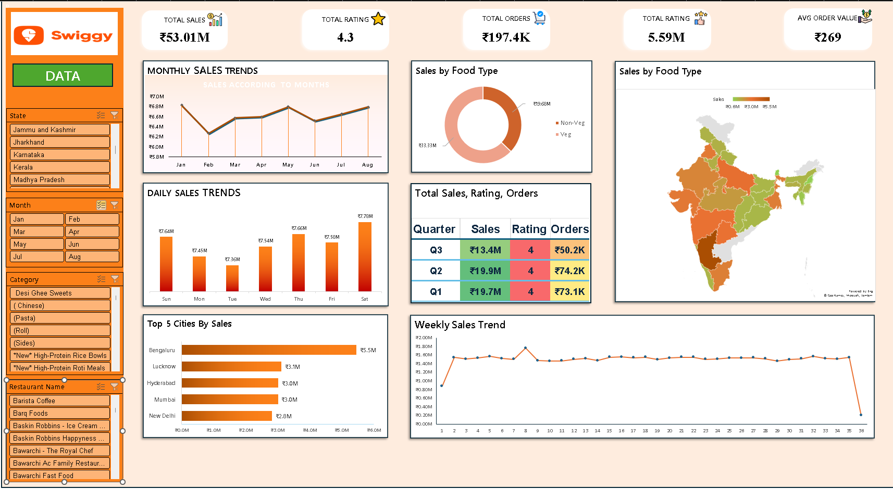

# 🍔 Swiggy Data Analysis: EDA & Interactive Dashboard

### 📊 Project Overview
This project involves a comprehensive analysis of a large Swiggy sales dataset comprising over **197,000 orders** and generating **₹5.3 Crores** in revenue. The workflow integrates Python for data cleaning and Exploratory Data Analysis (EDA), followed by Power BI for creating an interactive business intelligence dashboard.

The goal was to decode consumer behavior, identify top-performing regions, and analyze dietary preferences (Veg vs. Non-Veg) using advanced data visualization techniques.

---

### 📷 Power BI Dashboard



---

### 🐍 Python EDA Process (Exploratory Data Analysis)
Before building the dashboard, extensive EDA was performed using **Python** in a Jupyter Notebook to understand the data structure and trends.

**Key Analysis Steps:**
* **Data Cleaning:** Handled datatypes and converted `Order Date` for time-series analysis.
* **Feature Engineering:** Created a custom `Food Category` column by classifying items as **Veg** or **Non-Veg** based on keywords (e.g., "Chicken", "Fish", "Biryani").
* **Visualizations Created:**
    * **📈 Monthly & Weekly Sales Trends:** Analyzed revenue fluctuations over time using Matplotlib.
    * **🥧 Veg vs. Non-Veg Analysis:** Used **Plotly** pie charts to visualize the revenue split.
    * **🏙️ Geographic Analysis:** Horizontal bar charts showing revenue contribution by State and City.
    * **📅 Day-wise Activity:** Identified busiest days of the week using Matplotlib.

---

### 🛠️ Tech Stack & Tools Used

**1. Python (Data Processing & EDA)**
* **Pandas:** For data manipulation, aggregation, and cleaning.
* **NumPy:** For numerical operations and array handling.
* **Matplotlib & Seaborn:** For static statistical plots (Line charts, Daily trends).
* **Plotly:** For interactive and dynamic visualizations (Pie charts, Bar graphs).

**2. Business Intelligence**
* **Power BI:** Built the final report for stakeholders.
* **DAX (Data Analysis Expressions):** Used for creating complex measures

---

### 🗝️ Key Insights & Findings

* **💰 Massive Scale:** The dataset covers **197,430 orders** with a total revenue of **₹5.3 Crores**.
* **🏆 Top Locations:** **Bengaluru** emerged as the highest revenue-generating city, followed by major metros like Mumbai and Delhi.
* **🥦 Dietary Preferences:**
    * Vegetarian orders dominated the volume, accounting for **~63%** of sales.
    * Non-Veg items (Chicken, Fish, etc.) had a higher average order value but lower volume.
* **📅 Peak Operations:** **Saturdays** recorded the highest order volume, indicating a strong weekend ordering culture.
* **📉 Time Trends:** Monthly and quarterly analysis revealed specific growth patterns in 2025.

---

### 📂 Dataset Structure
The analysis utilizes `Swiggy Raw Data Excel.xlsx`, processed via Python (`swiggy EDA.ipynb`) containing:
* **Time Series:** Order Date, Quarters, Week Numbers.
* **Geography:** State, City, Location.
* **Product:** Dish Name, Category (Snacks, Main Course), Food Type.
* **Metrics:** Price (INR), Rating, Rating Count.

---

### 🚀 How to Run the Analysis
1.  Clone this repository:
    ```bash
    git clone [https://github.com/YashConnect](https://github.com/YashConnect/Swiggy-Dashboard.git)
    ```
2.  Install the required Python libraries:
    ```bash
    pip install pandas numpy matplotlib seaborn plotly openpyxl
    ```
3.  Run the Jupyter Notebook:
    ```bash
    jupyter notebook "swiggy EDA.ipynb"
    ```
4.  *(Optional)* Open the `.pbix` file in **Power BI Desktop** to explore the dashboard.

---

### 📬 Connect
If you found this analysis interesting or have feedback, feel free to connect!
[**My LinkedIn Profile**](https://www.linkedin.com/in/yash-mahadik-ba328a374/)